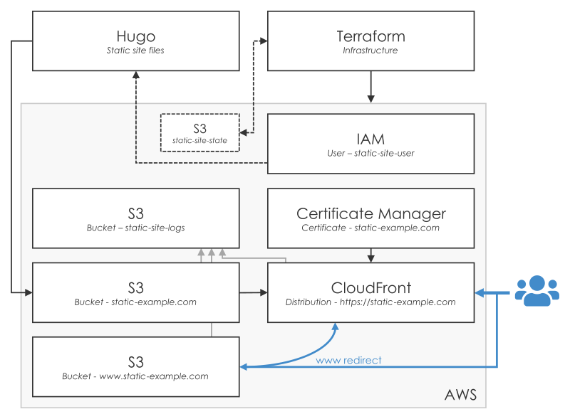

# HTTPS static site with Hugo and Terraform

Source code for my [post by the same name](https://nicholasarmstrong.com/2020/05/https-static-site-hugo-terraform/) on
using Hugo together with Terraform, S3, and CloudFront to host high-performance static websites.

## Motivation

As of early 2020, I couldn't find a single source that did everything I wanted when making a static site -- which meant
pulling bits from a lot different sources. Some of the limitations I encountered were:

* No Terraform state store
* Broken redirects when using S3 origin for CloudFront
* Missing public bucket policies, or do not disable the public access block
* Not using Hugo's new deployment features
* No HTTPS, or certificate in wrong region
* No logs for buckets and distributions
* Old Terraform syntax
* Put credentials in Terraform vars, rather than `aws configure`
* Requiring Route53 for DNS

This repo attempts to rectify that problem.  The contents were created when building the static website for
[DexManus](https://dexmanus.com), a startup I am currently advising.

More background can be found
[in the blog post](https://nicholasarmstrong.com/2020/05/https-static-site-hugo-terraform/).

## Checkout

To checkout:

```console
$ git clone https://github.com/ndrarmstrong/hugo-terraform-aws.git
$ cd hugo-terraform-aws
$ git submodule update --init --recursive
```

## Development container

The included development container includes all of the software needed to build and deploy the site.  To build the
development container:

```console
$ docker-compose build
```

To run the development container:

```console
$ docker-compose run --rm static-dev
```

The last command starts an instance of the container, and runs a shell within it.  The Hugo site directory is mounted at
`~/site`, and all of the Terraform scripts are mounted at `~/infra`.

If you don't have Docker installed, follow the official instructions for [installing
Docker](https://docs.docker.com/get-docker/) and installing [Docker Compose](https://docs.docker.com/compose/install/)
before running the steps above.


## Site

An example Hugo site is stored in `/site`; you may want to follow
[the Hugo quick start](https://gohugo.io/getting-started/quick-start/) to create a new site instead.

### Build website

To build and watch the site:

```console
$ hugo serve
```

You will need to add `--bind=0.0.0.0` to the above command if you are accessing from a machine different from
the one Hugo is running on.

To build the site into static files:

```console
$ hugo
```

The resulting static site will be placed in the generated `public` directory.

### Site settings

Hugo needs to be configured to deploy to the AWS infrastructure you will set up below.  Adjust `site/config.toml`
with the S3 bucket URL and Cloudfront distribution ID from your Terraform deployment:

```toml
[deployment]
  [[deployment.targets]]
    name = "S3"
    URL = "s3://static-example.nicholasarmstrong.com?region=ca-central-1" // Terraform output 's3_bucket_url'
    cloudFrontDistributionID = "ABC12345" // Terraform output 'cf_distribution_id'
```

If you created a new Hugo site, copy the entire block above into your `config.toml` and adjust for your deployment.

### Deploy website

You can use Hugo's built-in capability to upload the static site files to S3 and invalidate the CloudFront distribution
that serves them.  You do this whenever you want to update the content of your website.

To deploy, start by setting the AWS IAM user you use for publishing:

```console
$ aws configure
```

Then clear the output directory, build, and deploy:

```console
$ cd site
$ rm -rf public
$ hugo
$ hugo deploy --verbose --maxDeletes -1 --invalidateCDN --confirm
```

You should see the updated website on your CloudFront endpoint (Terraform output `cf_website_endpoint`) shortly after --
in my experience, CloudFront can take upward of 5 minutes to complete a deployment, but you'll often see the new version
before it completes.

## Infrastructure

Before you deploy the website with Hugo for the first time, you'll need to set up the AWS infrastructure for the site.
You only need to do this once, not on every site deploy.  The resulting architecture is shown in the diagram below:



### User

You will need an AWS IAM user with permissions to manage S3, CloudFront, ACM, and IAM to create the site infrastructure.

Before executing the steps below, start by setting the AWS IAM user you use for infrastructure changes:

```console
$ aws configure
```

### Terraform state bucket

We use Terraform's S3 backend to store Terraform state in an S3 bucket.  We must create the bucket before using it;
we can do so using a separate Terraform project.

Edit `infra/state/variables.tf` to match your site, choose your region in `infra/state/terraform.tf`, then:

```console
$ cd infra/state/
$ terraform init
$ terraform apply
```

Terraform will create your state bucket:

```
aws_s3_bucket.tf_state: Creating...
aws_s3_bucket.tf_state: Creation complete after 4s [id=example-static-site-state]

Apply complete! Resources: 1 added, 0 changed, 0 destroyed.

Outputs:

s3_backend_bucket = example-static-site-state
s3_backend_key = global/s3/terraform.tfstate
s3_backend_region = us-east-1
```

Update the site Terraform configuration to use your new state bucket by copying the values output by Terraform
in the previous step into `infra/site/terraform.tf`:

```terraform
terraform {
  backend "s3" {
    # Replace with your state bucket name and region
    bucket = "example-static-site-state"
    region = "ca-central-1"
    key    = "global/s3/terraform.tfstate"
  }
}
```

Every resource created in the `infra/site` directory will now use the new state bucket.

### Site infrastructure

Terraform files for the static site infrastructure are stored in `infra/site`.  Edit `infra/site/variables.tf` to match
your site and set your primary region in `infra/site/terraform.tf`.  Then, initialize Terraform:

```console
$ cd infra/site
$ terraform init
```

Once Terraform is initialized, create the ACM certificate _only_.  You'll need to manually verify this using the
AWS console before applying the rest of the infrastructure.

```console
$ terraform apply -target=aws_acm_certificate.site
```

Once your certificate is show as Issued in the AWS console, you can apply the rest of the infrastructure with:

```console
$ terraform apply
```

The output from Terraform contains all of the values you need to configure Hugo and the rest of your
infrastructure:

```
Outputs:

cf_distribution_id = ABC12345
cf_website_endpoint = d1234567.cloudfront.net
iam_publish_access_key = AKIAxxxxxxx
iam_publish_secret_key = xxxxxxxxxxx
s3_bucket = static-example.nicholasarmstrong.com.s3.ca-central-1.amazonaws.com
s3_redirect_endpoint = www.static-example.nicholasarmstrong.com.s3-website.ca-central-1.amazonaws.com
```

### DNS

Update your DNS nameserver so that:

* Your root domain (either `@` or the subdomain you are using) is a CNAME/ALIAS to the value Terraform gave in
  output `cf_website_endpoint`
* Your `www` domain is a CNAME/ALIAS to the value Terraform gave in output `s3_redirect_endpoint`

Whether you use CNAME or ALIAS depends on whether your nameserver supports ALIAS or CNAME flattening. See the discussion
[in the blog post](https://nicholasarmstrong.com/2020/05/https-static-site-hugo-terraform/) for more information.

## More information

I used the following resources when creating this repository:

* Guides
  * [Creating your serverless website in Terraform](https://www.intricatecloud.io/2018/04/creating-your-serverless-website-in-terraform-part-2/)
  * [5 minute static SSL website](https://medium.com/modern-stack/5-minute-static-ssl-website-in-aws-with-terraform-76819a12d412)
  * [Hosting our static site over SSL](https://medium.com/runatlantis/hosting-our-static-site-over-ssl-with-s3-acm-cloudfront-and-terraform-513b799aec0f)
* AWS
  * [AWS static website guide](https://docs.aws.amazon.com/AmazonS3/latest/dev/HostingWebsiteOnS3Setup.html)
  * [ACM DNS validation](https://docs.aws.amazon.com/acm/latest/userguide/gs-acm-validate-dns.html)
  * [CloudFront price classes](https://docs.aws.amazon.com/AmazonCloudFront/latest/DeveloperGuide/PriceClass.html)
* Terraform 
  * [Terraform provider aliases](https://www.terraform.io/docs/configuration/providers.html#alias-multiple-provider-instances)
  * [Managing Terraform state with S3](https://blog.gruntwork.io/how-to-manage-terraform-state-28f5697e68fa)
  * [Purpose of Terraform state](https://www.terraform.io/docs/state/purpose.html)
  * [Terraform: s3_bucket](https://www.terraform.io/docs/providers/aws/r/s3_bucket.html)
  * [Terraform: cloudfront_distribution](https://www.terraform.io/docs/providers/aws/r/cloudfront_distribution.html)
  * [Terraform: acm_certificate](https://www.terraform.io/docs/providers/aws/r/acm_certificate.html)
  * [Terraform: iam_user](https://www.terraform.io/docs/providers/aws/r/iam_user.html)
* Hugo
  * [Quick start](https://gohugo.io/getting-started/quick-start/)
* DNS
  * [Understand CNAME flattening](https://support.cloudflare.com/hc/en-us/articles/200169056-Understand-and-configure-CNAME-Flattening)
  * [Differences among A, CNAME, ALIAS, and URL records](https://support.dnsimple.com/articles/differences-between-a-cname-alias-url/)